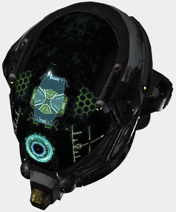

# mugl - μGL

[](./LICENSE) [](https://www.npmjs.com/package/mugl) [](https://github.com/andykswong/mugl/actions/workflows/build.yaml)

> A micro-sized, modular WebGL and glTF library in TypeScript.

## Overview

`mugl` is a minimalistic, modular WebGL 3D rendering library for Typescript / JavaScript.

- **Core module (`mugl`)** : the [rendering device interface](./src/device/device.ts) in a simplified [WebGPU](https://gpuweb.github.io/gpuweb/)-style API that removes WebGL state management from you. (**10KB** in size)
  - **Nano implementation (`ngl`)**: **3KB** implementation of the rendering device interface, but without WebGL2 support. You can even turn off some [features](./src/nano/features.ts) that you do not need (e.g. scissor, stencil testing) to reduce the size to **2KB**!
- **glTF module (`mugl/gltf`) (WIP)**: a minimalistic glTF 2.0 model loader and renderer (**10KB** in size)

*\* File sizes are measured from minified and gzipped UMD Webpack library bundles. Actual size can be even smaller, by using a module bundler with tree shaking.*

## [glTF 2.0 Model Viewer](http://andykswong.github.io/mugl/examples/gltf.html) (WIP)
A minimal **13KB** (gzipped) glTF model viewer built on `mugl` is available as an [example](http://andykswong.github.io/mugl/examples/gltf.html) usage of this library. The source code can be found [here](https://github.com/andykswong/mugl/tree/main/src/examples/gltf-viewer).

Any model from [glTF-Sample-Models](https://github.com/KhronosGroup/glTF-Sample-Models) can be loaded using the `model` and `variant` URL parameter, e.g.: [?model=Buggy&variant=glTF-Binary](http://andykswong.github.io/mugl/examples/gltf.html?model=Buggy&variant=glTF-Binary&camera=0&scene=0) to load the [Buggy](https://github.com/KhronosGroup/glTF-Sample-Models/tree/master/2.0/Buggy) model. You can also use the `url` URL parameter to load a model from any source ([example](http://andykswong.github.io/mugl/examples/gltf.html?url=https://raw.githubusercontent.com/KhronosGroup/glTF-Sample-Models/master/2.0/Avocado/glTF/Avocado.gltf)).



## Install
```shell
npm install --save mugl
```

## Usage

### 0. GlTF 2.0 Rendering
Below is the minimum setup required to render a GlTF 2.0 model:

```javascript
import { getGLDevice } from 'mugl';
import { renderGlTF, resolveGlTF } from 'mugl/gltf';

// 1. Create WebGL rendering device from an existing canvas
const device = getGLDevice(canvas);
if (!device) throw new Error('WebGL is unsupported');

// 2. Async load a GlTF/GLB file
const glTFPromise = resolveGlTF({ uri: 'DamagedHelmet.gltf' });

// 3. Render the GlTF model
glTFPromise.then(glTF => {
  renderGlTF(device, glTF);
});
```

### 1. Basic Rendering Example
Below is a simple `mugl` program to draw a triangle (See this example live [here](https://andykswong.github.io/mugl/examples/#basic)):

```javascript
import { UniformFormat, UniformType, VertexFormat, getGLDevice } from 'mugl';

// 0. Prepare triangle vertex positions and colors data
const triangle = new Float32Array([
  // position  color
  0.0, 0.5,    1.0, 0.0, 0.0, 1.0,
  0.5, -0.5,   0.0, 1.0, 0.0, 1.0,
  -0.5, -0.5,  0.0, 0.0, 1.0, 1.0,
]);

// 1. Create WebGL rendering device from an existing canvas
const device = getGLDevice(canvas);
if (!device) throw new Error('WebGL is unsupported');

// 2. Create GPU buffer for the triangle data
const buffer = device.buffer({ size: triangle.byteLength }).data(triangle);

// 3. Create pipeline object for drawing the triangle
const pipeline = device.pipeline({
  vert: `
    uniform float angle;
    attribute vec2 position;
    attribute vec4 color;
    varying lowp vec4 vColor;
    void main () {
      gl_Position = vec4(
        cos(angle) * position.x - sin(angle) * position.y,
        sin(angle) * position.x + cos(angle) * position.y,
        0, 1);
      vColor = color;
    }`,
  frag: `
    varying lowp vec4 vColor;
    void main () {
      gl_FragColor = vColor;
    }`,
  buffers: [{
    attrs: [
      { name: 'position', format: VertexFormat.Float2 },
      { name: 'color', format: VertexFormat.Float4 }
    ]
  }],
  uniforms: {
    'angle': { type: UniformType.Value, format: UniformFormat.Float }
  }
});

// 4. Create default render pass object
const pass = device.pass();

// 5. Submit draw call in a render pass
device
  .render(pass)
    .pipeline(pipeline)
    .vertex(0, buffer)
    .uniforms({ 'angle': Math.PI / 2 })
    .draw(3)
  .end();
```

### 2. Using the Nano Implementation
To use the Nano Implementation, use `getNGLDevice` to create a device:

```javascript
import { getNGLDevice } from 'mugl';

const device = getNGLDevice(canvas);
```

## [More Examples](http://andykswong.github.io/mugl/examples)
Check out the [live examples](http://andykswong.github.io/mugl/examples). The source code of all examples can be found [here](https://github.com/andykswong/mugl/tree/main/src/examples).

## API
TSDoc: http://andykswong.github.io/mugl

## License
This repository and the code inside it is licensed under the MIT License. Read [LICENSE](./LICENSE) for more information.
