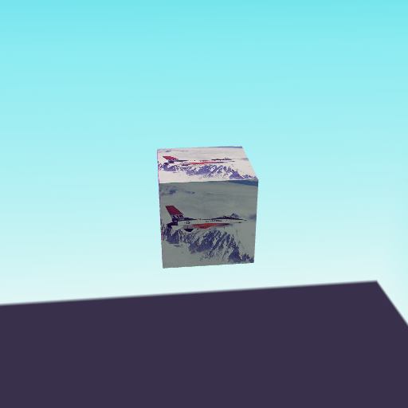

<h1 align="center">█▓▒­░⡷⠂μＧＬ⠐⢾░▒▓█</h1>
<h2 align="center">mugl - Micro 3D Graphics Library for JavaScript and WebAssembly</h2>
<br/>

[](https://github.com/andykswong/mugl)
[](https://www.npmjs.com/package/mugl)
[](http://andykswong.github.io/mugl)
[](./LICENSE)
[](https://github.com/andykswong/mugl/actions/workflows/build.yaml)

<br/>


## Overview

`mugl` is a minimal, modern 3D graphics abstraction layer that provides a simplified [WebGPU](https://gpuweb.github.io/gpuweb/)-style low-level graphics API for JavaScript. It:
- supports both WebGPU and WebGL 2.0
- runs on any modern web browser (WebGL/WebGPU) and React Native mobile app (WebGL)
- runs on WebAssembly (WASM) with [AssemblyScript](https://www.assemblyscript.org/) binding (WebGL/WebGPU)

If you want to use WebGPU from JS or WASM code with fallback to WebGL, `mugl` is for you; If you just want to use WebGL, but would like to avoid the verbosity and state management aspect of WebGL, `mugl` is for you as well.

## Documentation
- Latest JavaScript / AssemblyScript interface: [(link)](http://andykswong.github.io/mugl/latest/docs)
- Raw WebAssembly API spec: [API.wit](./API.wit), [AssemblyScript imports](./assembly/mugl.ts)

## Showcase

### [Live Examples](https://andykswong.github.io/mugl/latest/examples)
Check out the live examples [here](https://andykswong.github.io/mugl/latest/examples).

The source code of all examples can be found [here](./packages/examples/src/apps/). All examples run on **both WebGL and WebGPU, for both JavaScript and WebAssembly, using the same code base**! Click the toggles in the examples menu to seamlessly switch between JS/WASM and WebGL/WebGPU.

|   |   |   |
|---|---|---|
|[](https://andykswong.github.io/mugl/latest/examples/#basic)|[](https://andykswong.github.io/mugl/latest/examples/#instancing)|[](https://andykswong.github.io/mugl/latest/examples/#postprocess)|
|[](https://andykswong.github.io/mugl/latest/examples/#mrt)|[](https://andykswong.github.io/mugl/latest/examples/#stencil)|[](https://andykswong.github.io/mugl/latest/examples/#pbr)|

### [glTF 2.0 Model Viewer](https://andykswong.github.io/mugl/latest/gltf-viewer)
[](https://andykswong.github.io/mugl/latest/gltf-viewer/?model=DamagedHelmet)

A small but full-featured glTF model viewer built on `mugl` is available as an example usage of this library [here](https://andykswong.github.io/mugl/latest/gltf-viewer). \
The source code can be found [here](./packages/gltf-viewer).

Any model from [glTF-Sample-Models](https://github.com/KhronosGroup/glTF-Sample-Models) can be loaded using the `model` and `variant` URL parameter, \
e.g.: [?model=Buggy&variant=glTF-Binary](https://andykswong.github.io/mugl/latest/gltf-viewer/?model=Buggy&variant=glTF-Binary&camera=0&scene=0) to load the [Buggy](https://github.com/KhronosGroup/glTF-Sample-Models/tree/master/2.0/Buggy) model. \
You can also use the `url` URL parameter to load a model from any source ([example](https://andykswong.github.io/mugl/latest/gltf-viewer/?url=https://raw.githubusercontent.com/KhronosGroup/glTF-Sample-Models/master/2.0/Avocado/glTF/Avocado.gltf)).

<br style="clear: both" />

## Usage

### 0. Install
```shell
npm install --save mugl
```

### 1. Basic Rendering
Below is the minimal `mugl` program to draw a triangle (See this example live [here](https://andykswong.github.io/mugl/latest/examples/#basic)):
```javascript
import { ShaderStage, VertexFormat, vertexBufferLayouts, WebGL } from 'mugl';

// 0. Prepare triangle vertex positions and colors data
const triangle = new Float32Array([
  // position  color
  +0.0, +0.5,  1.0, 0.0, 0.0, 1.0, // vertex 0
  +0.5, -0.5,  0.0, 1.0, 0.0, 1.0, // vertex 1
  -0.5, -0.5,  0.0, 0.0, 1.0, 1.0, // vertex 2
]);

// 1. Create WebGL rendering device from an existing canvas
const device = WebGL.requestWebGL2Device(canvas);
if (!device) throw new Error('WebGL 2.0 is unsupported');

// 2. Create GPU buffer and upload the triangle data
const buffer = WebGL.createBuffer(device, { usage, size: triangle.byteLength });
WebGL.writeBuffer(device, buffer, triangle);

// 3. Compile the vertex and fragment shaders
const vertex = WebGL.createShader(device, {
  usage: ShaderStage.Vertex,
  code: `#version 300 es
    layout (location=0) in vec2 position;
    layout (location=1) in vec4 color;
    out vec4 vColor;
    void main () {
      gl_Position = vec4(position, 0., 1.);
      vColor = color;
    }`
});
const fragment = WebGL.createShader(device, {
  usage: ShaderStage.Fragment,
  code: `#version 300 es
    precision mediump float;
    in vec4 vColor;
    out vec4 outColor;
    void main () {
      outColor = vColor;
    }`
});

// 4. Create the pipeline object
const pipeline = WebGL.createRenderPipeline(device, {
  vertex, fragment,
  // vertexBufferLayouts(...) auto-calculates the stride and offsets of vertex attributes for you
  // Attribute indices / ordering must match the attribute locations specified in vertex shader
  buffers: vertexBufferLayouts([
    { attributes: [/* position */ VertexFormat.F32x2, /* color */ VertexFormat.F32x4] }
  ]),
});

// 5. Submit draw call in a render pass
WebGL.beginRenderPass(device);
  WebGL.setRenderPipeline(device, pipeline);
  WebGL.setVertex(device, 0, buffer);
  WebGL.draw(device, 3); // 3 vertices to draw
WebGL.submitRenderPass(device);

// 6. GPU resources are freed automatically when unused, but you can also explicitly destroy them to free up GPU memory
vertex.destroy();
fragment.destroy();
pipeline.destroy();
buffer.destroy();
device.destroy();
```

### 2. Running on React Native Mobile Apps via expo-gl
`mugl` is compatible with [expo-gl](https://docs.expo.dev/versions/latest/sdk/gl-view/) for 3D rendering on Expo / React Native mobile apps. Below is the setup required to use `mugl` with `expo-gl` (source code of the full example can be found [here](./packages/examples-native/)):

```javascript
import React from 'react';
import { Asset } from 'expo-asset';
import { GLView } from 'expo-gl';
import { WebGL } from 'mugl';

export default function App() {
  return (<GLView style={{ width: 300, height: 300 }} onContextCreate={onContextCreate} />);
}

async function onContextCreate(gl) {
  // 1. Create device by passing a canvas-like object that wraps the gl context
  const canvas = { getContext() { return gl; }, width: 300, height: 300 };
  const device = WebGL.requestWebGL2Device(canvas);

  // 2. Use expo-asset to load an image to GPU texture
  const image = (await Asset.loadAsync(require('./image.png')))[0];
  const size = [512, 512, 1];
  const texture = WebGL.createTexture(device, { size });
  WebGL.copyExternalImageToTexture(device, { src: image }, { texture }, size);

  // 3. Setup other resources
  const pipeline = WebGL.createRenderPipeline(device, { ... });
  const buffer = WebGL.createBuffer(device, { ... });
  WebGL.writeBuffer(device, buffer, ...);
  const bindgroup = WebGL.createBindGroup(device, { layout, entries: [{ texture }] });

  // 4. Render as usual
  WebGL.beginRenderPass(device);
    WebGL.setRenderPipeline(device, pipeline);
    WebGL.setVertex(device, 0, buffer);
    WebGL.setBindGroup(device, 0, bindgroup);
    WebGL.draw(device, ...);
  WebGL.submitRenderPass(device);

  // 5. Call the expo-gl 'swap buffers' API at the end of each frame
  // See: https://docs.expo.dev/versions/latest/sdk/gl-view/#webgl-api
  gl.endFrameEXP();
}
```

As `expo-gl` does not fully support all WebGL2 APIs, you may find some advanced features of `mugl` not working as expected. Notably missing is `pixelStorei` API support for defining texture image source offsets.

### 3. Running on WebAssembly
Import `mugl/wasm` to your WASM module:

```javascript
// 1. Import mugl/wasm
import * as muglWasm from 'mugl/wasm';

// 2. Import your WASM module as ESM (require Webpack with experiments.asyncWebAssembly = true):
import * as exports from './your_module.wasm';

// 2b. Alternatively, using the WASM API, add mugl/wasm to your module imports
const imports = { 'mugl/wasm': muglWasm, ... };
const exports = (await WebAssembly.instantiateStreaming(
  fetch('your_module.wasm'), imports
)).instance.exports;

// 3. Expose WASM module memory to mugl. This must be done before your WASM module calls any mugl method.
const CONTEXT_ID = 123; // Define a unique numeric ID for your WASM module
muglWasm.set_context_memory(CONTEXT_ID, exports.memory);
```

In the AssemblyScript WASM module, you can then use `getCanvasById` to get a canvas handle for creating a device:
```javascript
import { getCanvasById, WebGL } from 'mugl';
const CONTEXT_ID = 123; // This must be the same ID as above
const device = WebGL.requestWebGL2Device(getCanvasById(CONTEXT_ID, 'canvasId'));
```

See the [examples source code](./packages/examples) on how to build an AssemblyScript mugl app.

## License
This repository and the code inside it is licensed under the MIT License. Read [LICENSE](./LICENSE) for more information.
